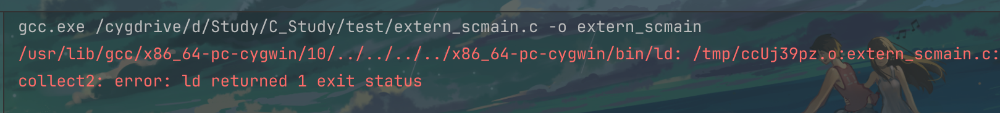
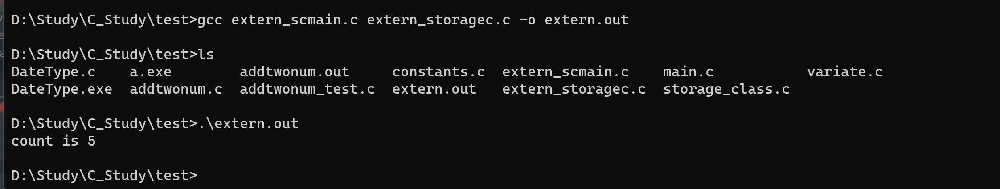
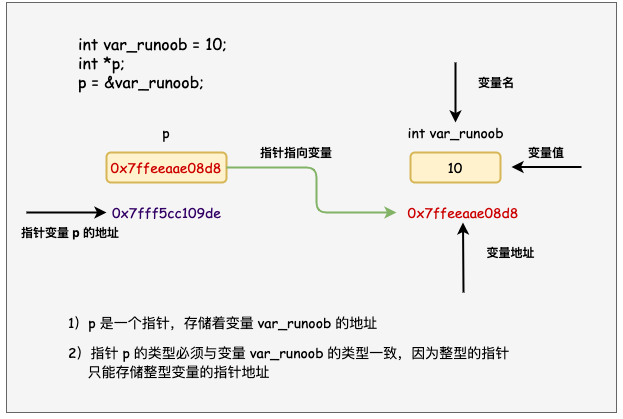
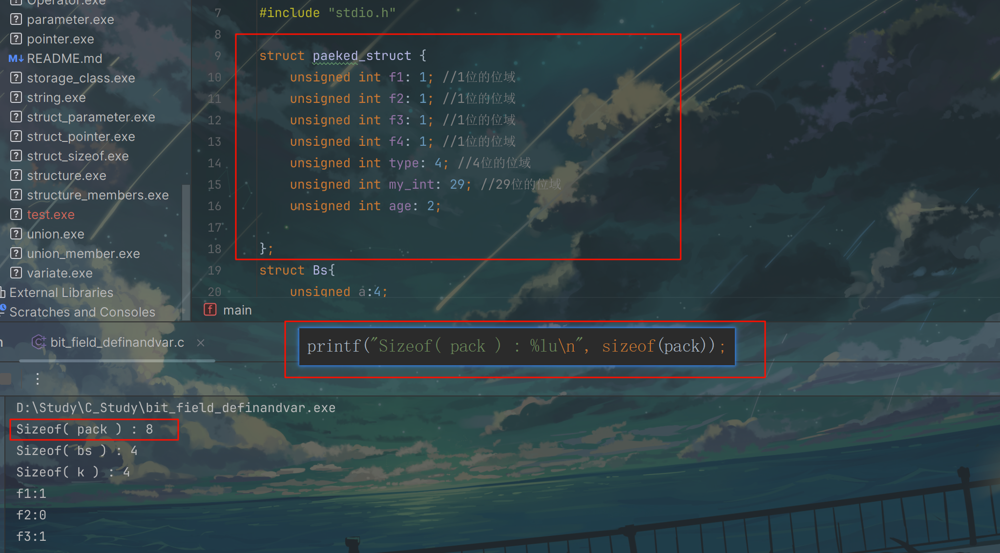

- 240116

基本语法学习 \
数据类型

### 关于多个文件编译的问题
-- 直接运行编译报错

解决：多源文件的编译方法
cmd  gcc 多个文件名 进行编译 \
用法：#gcc testfun.c test.c -o test\
作用：将testfun.c和test.c分别编译后链接成test可执行文件。\
执行：.\+名字

## 240215 关于位域问题

其位域大小为8Byte字节
原因如下：
一个位域在同一个字节里，一个不够了 就会从下一个开始放，不会拆开，一个int 4字节 32位，像这个 前面11114 
可以存在一个 32位 里 但是接下来29位放不下了 就另外开了一个 然后剩下的一个2 跟29加起来是31 也没过4字节 
所以放一块了

这就为什么会出现无名位域来填充或是调整位置
